# Lunar Lander - DQN vs PPO

Reinforcement learning agents that learn to land a spacecraft on the moon using **Deep Q-Network (DQN)** and **Proximal Policy Optimization (PPO)**, trained and compared side-by-side on the [LunarLander-v3](https://gymnasium.farama.org/environments/box2d/lunar_lander/) environment.

Built with **PyTorch** and **Gymnasium**. Developed and trained on **Databricks**.

<p align="center">
  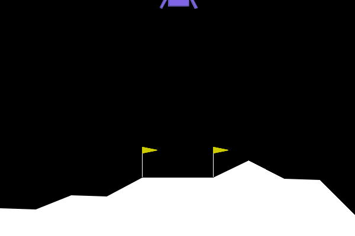
  <br/>
  <em>Trained DQN agent performing smooth controlled landings</em>
</p>

<p align="center">
  
  <br/>
  <em>Lunar Lander Reinforcement Learning explained (<a href="https://www.youtube.com/watch?v=i8ZBA4Vqa14">YouTube source</a>)</em>
</p>

---

## Training Progression

Watch the agent evolve from random crashing to controlled landings:

<p align="center">
  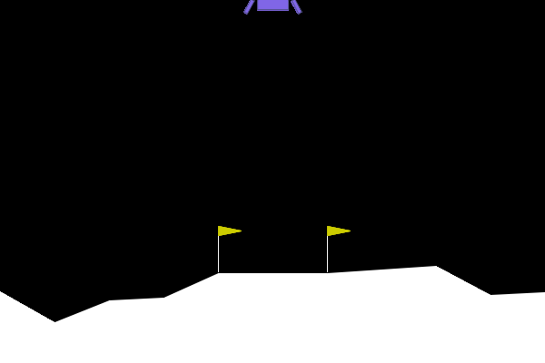
  <br/>
  <em>From random chaos to precise landings across training stages</em>
</p>

---

## The Problem

The [LunarLander-v3](https://gymnasium.farama.org/environments/box2d/lunar_lander/) environment simulates landing a spacecraft between two flags on the moon's surface.

<p align="center">
  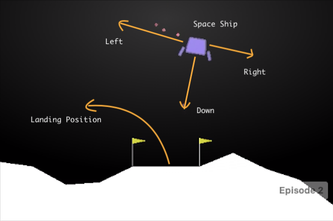
  <br/>
  <em>The spacecraft must navigate to the landing pad between the two flags</em>
</p>

### The RL Loop

The agent interacts with the environment in a classic reinforcement learning cycle:

<p align="center">
  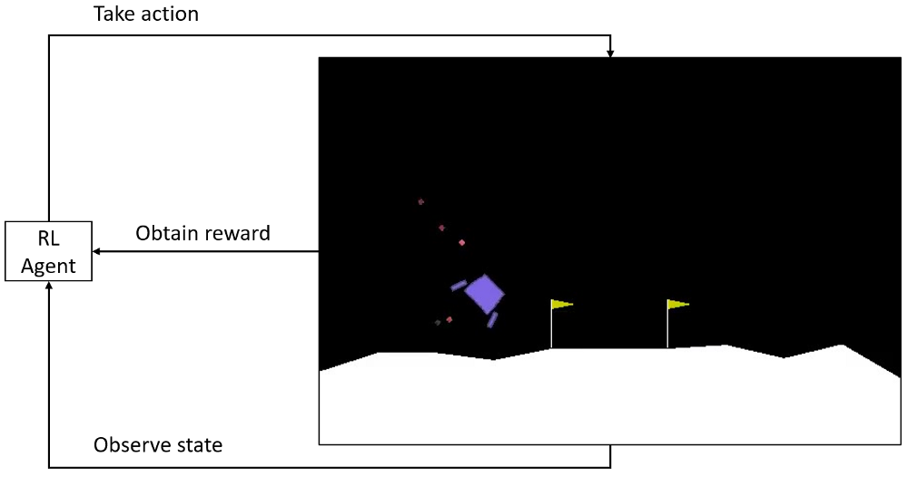
</p>

At each timestep the agent **observes** the current state, **selects an action** (which thruster to fire), receives a **reward** signal, and transitions to the next state. Over thousands of episodes, the agent learns which actions lead to successful landings.

### State Space

The agent receives **8 continuous values** per timestep:

| Index | Feature | Description |
|-------|---------|-------------|
| 0-1 | Position | x, y coordinates |
| 2-3 | Velocity | Horizontal and vertical speed |
| 4-5 | Orientation | Angle and angular velocity |
| 6-7 | Leg contact | Left/right leg touching ground (boolean) |

<p align="center">
  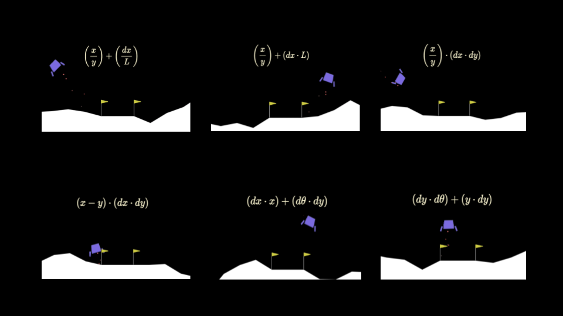
  <br/>
  <em>Visualizing how different state variable combinations affect the lander's behavior</em>
</p>

### Action Space & Rewards

**4 discrete actions**: do nothing, fire left engine, fire main engine, fire right engine.

**Reward**: +100-140 for landing on pad, +10 per leg contact, -0.3 per main engine frame, -100 for crashing. **Solved** when average reward >= 200 over 100 consecutive episodes.

---

## Results

### DQN Performance

| Metric | Value |
|--------|-------|
| Solved at episode | **708** |
| Best avg reward (100-ep) | **260.2** |
| Eval avg reward | **226.7 +/- 96.7** |
| Eval success rate | **80%** |
| Eval max reward | **318.7** |

### DQN vs PPO Comparison

Both algorithms were trained for 1000 episodes on identical environments:

<p align="center">
  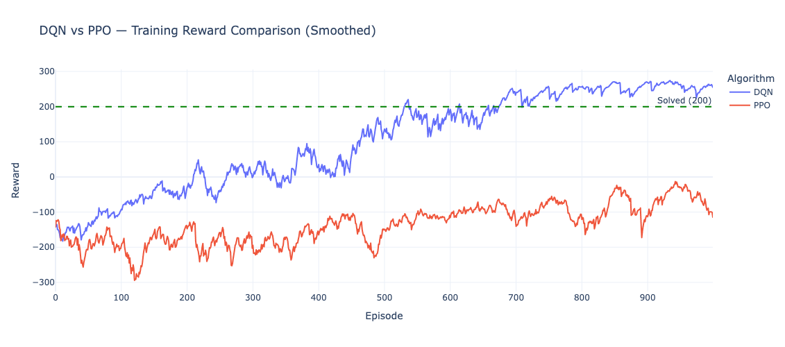
</p>

<p align="center">
  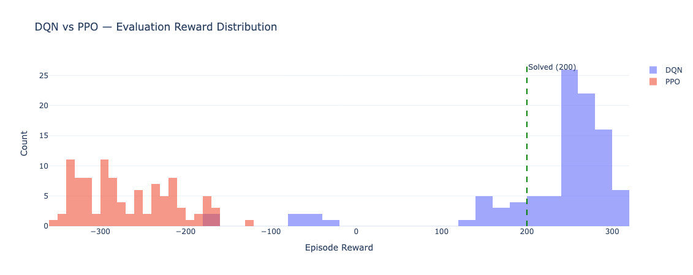
</p>

<p align="center">
  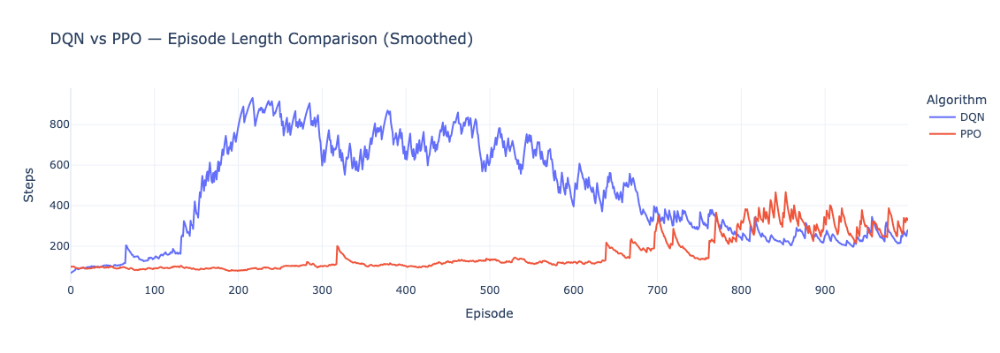
</p>

---

## Architecture

### DQN Agent

```
State (8) --> Linear(128) --> ReLU --> Linear(128) --> ReLU --> Q-values (4)
```

Three key components:

| Component | Purpose |
|-----------|---------|
| **Experience Replay** | Breaks temporal correlation by learning from shuffled past experiences |
| **Target Network** | Stabilizes training by providing a slowly-updated Q-value target |
| **Epsilon-Greedy** | Balances exploration (random actions) vs exploitation (learned policy) |

### PPO Agent (Actor-Critic)

```
State (8) --> Shared: Linear(128) --> ReLU --> Linear(128) --> ReLU
                |
                |--> Actor head --> Action probabilities (4)
                |--> Critic head --> State value V(s) (1)
```

| Component | Purpose |
|-----------|---------|
| **Clipped Surrogate Objective** | Prevents destructively large policy updates |
| **GAE (Generalized Advantage Estimation)** | Reduces variance in advantage estimates |
| **Entropy Bonus** | Encourages exploration through the policy itself |

### Algorithm Comparison

| | DQN | PPO |
|---|-----|-----|
| **Type** | Value-based | Policy-based (Actor-Critic) |
| **Exploration** | Epsilon-greedy (external) | Entropy bonus (internal) |
| **Data usage** | Off-policy (replay buffer) | On-policy (fresh rollouts) |
| **Stability trick** | Target network | Clipped objective |
| **Best suited for** | Simple discrete problems | Complex / continuous problems |

---

## Training Analysis

### Episode Rewards

<p align="center">
  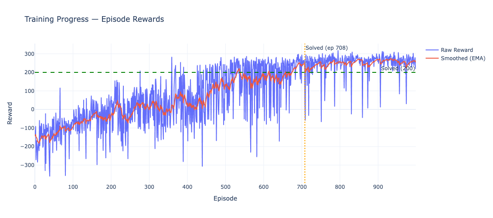
</p>

### Exploration Schedule

<p align="center">
  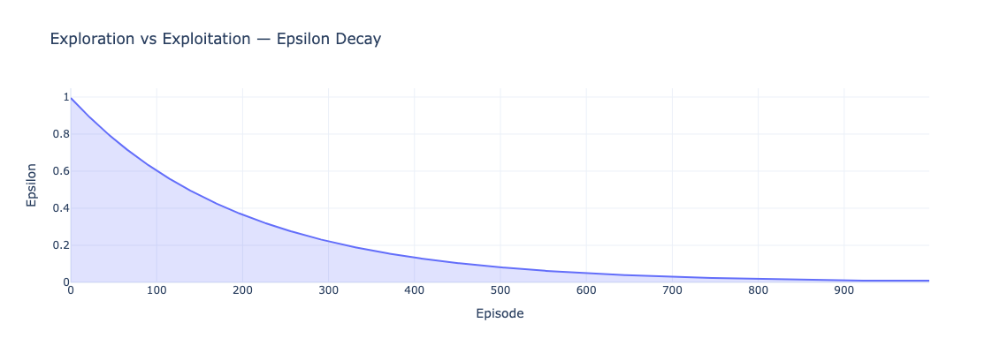
</p>

### Training Loss & Success Rate

<p align="center">
  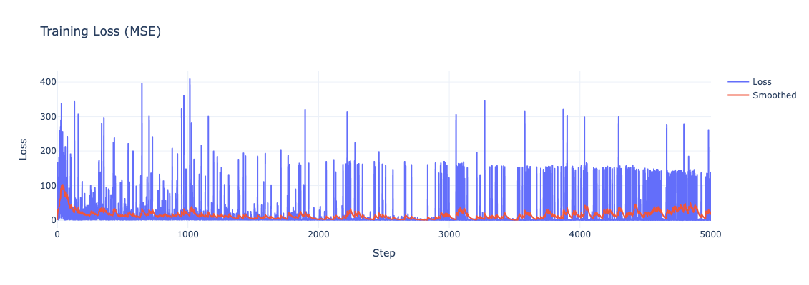
  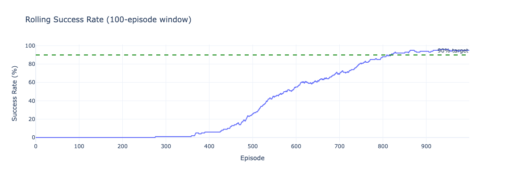
</p>

### Random vs Trained Agent

<p align="center">
  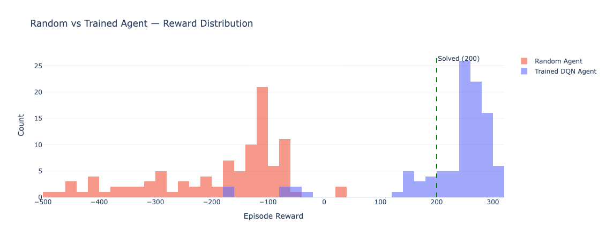
</p>

---

## Hyperparameters

### DQN

| Parameter | Value | Rationale |
|-----------|-------|-----------|
| Learning rate | 5e-4 | Standard for DQN on this environment |
| Discount (gamma) | 0.99 | Future rewards matter for landing |
| Epsilon decay | 0.995 | ~1000 episodes from exploration to exploitation |
| Batch size | 64 | Balance of speed and stability |
| Replay buffer | 100K | Enough diversity without memory issues |
| Target update | Every 10 episodes | Hard update frequency |
| Hidden layers | 128 x 128 | Sufficient for 8-dim state |
| Gradient clip | 1.0 | Prevents exploding gradients |

### PPO

| Parameter | Value |
|-----------|-------|
| Learning rate | 3e-4 |
| Discount (gamma) | 0.99 |
| GAE lambda | 0.95 |
| Clip epsilon | 0.2 |
| Entropy coefficient | 0.01 |
| Value coefficient | 0.5 |
| Update epochs | 4 |
| Rollout steps | 2048 |

---

## Project Structure

```
.
├── README.md
├── notebooks/
│   ├── lunar_lander_dqn_v1.py        # Initial Databricks notebook (DQN only)
│   ├── lunar_lander_dqn_v1.ipynb      # Jupyter notebook version with outputs
│   └── lunar_lander_dqn_v2.py        # Final version (DQN + PPO comparison)
├── models/
│   ├── best_agent.pt                  # Best DQN checkpoint
│   ├── solved_agent.pt                # DQN checkpoint at solve point
│   └── ppo_best_agent.pt             # Best PPO checkpoint
├── assets/                            # Training visualizations and demos
│   ├── trained-dqn-agent.gif
│   ├── training-progression.gif
│   ├── dqn-vs-ppo-rewards.png
│   └── ...
└── metrics.json                       # Full training metrics and config
```

## Tech Stack

- **PyTorch** - Neural network framework
- **Gymnasium** (Box2D) - RL environment
- **Plotly Express** - Interactive training visualizations
- **Databricks** - Training compute platform
- **imageio** - GIF/video recording

## How to Run

### On Databricks
Import any `.py` file from `notebooks/` directly into a Databricks workspace. The files use Databricks notebook source format with `# COMMAND ----------` cell delimiters.

### Locally
```bash
pip install torch gymnasium[box2d] plotly imageio[ffmpeg] pandas

# Run the v2 notebook (DQN + PPO) - remove Databricks-specific lines first:
#   - Remove lines starting with "# MAGIC"
#   - Remove "# COMMAND ----------" delimiters
#   - Update WORKSPACE_PATH to a local directory
python notebooks/lunar_lander_dqn_v2.py
```

### Load a Pre-trained Model

```python
import torch
import gymnasium as gym

# Load DQN agent
checkpoint = torch.load("models/best_agent.pt", weights_only=True)
# checkpoint contains: q_network, target_network, optimizer, epsilon, episode_count, training_step
```

---

## License

MIT
